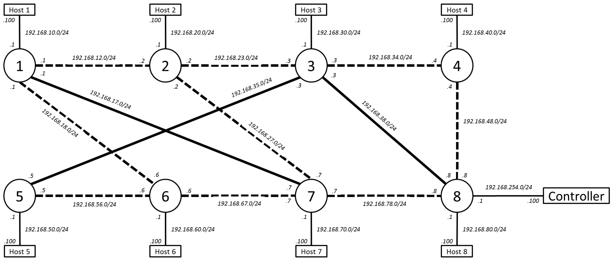

# Green IT - Dynamic Network Topologies
## Overview
The files contained in this repository are designed to test the implementation of a dynamic topology mechanism that performs the following:

* Based on overall network traffic, selects nodes to place into a standby state

* In the standby state, each node maintains one connection to a node in the active state, but shuts down all other connections. The intent is to make no routing decisions and reduce power consumption; all non-local traffic is forwarded from the standby node to the active node

The “Dissertation.pdf” document provides a full explanation of the research, development, and implementation of this project.

## Operation
There are three components in the dynamic topology mechanism:

* A centralized controller

* A collection of network nodes

* The host devices connected to the network nodes

These entities interact in the following loop:

1. Nodes: Send network traffic information to Controller

2. Controller: Analyze network traffic matrix and determine optimal topology

    * Focus on energy consumption reduction through the use of node standby states
    
    * Ensure link utilisation does not rise above a threshold value for any of the links
    
    * Apply optimisation heuristics

3. Controller/Nodes: Send/fetch the topology change information

4. Nodes: Implement the topology change

5. Repeat

For testing purposes, each network node contains a virtual machine that generates traffic to simulate a locally connected network. The full logical topology, including the virtual hosts running on each node and the centralized controller, is shown below:

    

 
The inter-node traffic generated by the hosts is designed to be classified as high, medium, or low load, and the controller correspondingly selects one of the three topologies shown below (grey nodes and links are in the standby state):

* **High traffic load**: No nodes are in the standby state

    

 

* **Medium traffic load**: Nodes 1, 2, and 4 are in the standby state

    

 

* **Low traffic load**: Nodes 1, 2, 4, 5, and 6 are in the standby state

    

 

## Implementation
